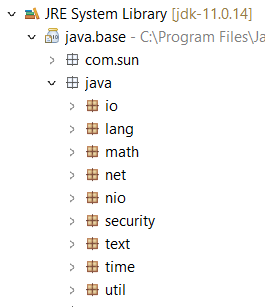

# Getting Started

Java Version : Java 11.0.14

### Reference Documentation

 

 [java.base](https://docs.oracle.com/en/java/javase/11/docs/api/java.base/module-summary.html)

1.  [io](https://docs.oracle.com/en/java/javase/11/docs/api/java.base/java/io/package-summary.html)
2.  [lang](https://docs.oracle.com/en/java/javase/11/docs/api/java.base/java/lang/package-summary.html)
3. 	[math](https://docs.oracle.com/en/java/javase/11/docs/api/java.base/java/math/package-summary.html) 
4. 	[net](https://docs.oracle.com/en/java/javase/11/docs/api/java.base/java/net/package-summary.html) 
5.	[nio](https://docs.oracle.com/en/java/javase/11/docs/api/java.base/java/nio/package-summary.html) 
6.	[security](https://docs.oracle.com/en/java/javase/11/docs/api/java.base/java/security/package-summary.html) 
7.  [text](https://docs.oracle.com/en/java/javase/11/docs/api/java.base/java/text/package-summary.html) 
8.  [time](https://docs.oracle.com/en/java/javase/11/docs/api/java.base/java/time/package-summary.html) 
9.  [util](https://docs.oracle.com/en/java/javase/11/docs/api/java.base/java/util/package-summary.html) 

## java-io

## java-lang

## java-math

## java-net

## java-nio

## java-security

## java-text

## java-time

## java-util

### Guides

